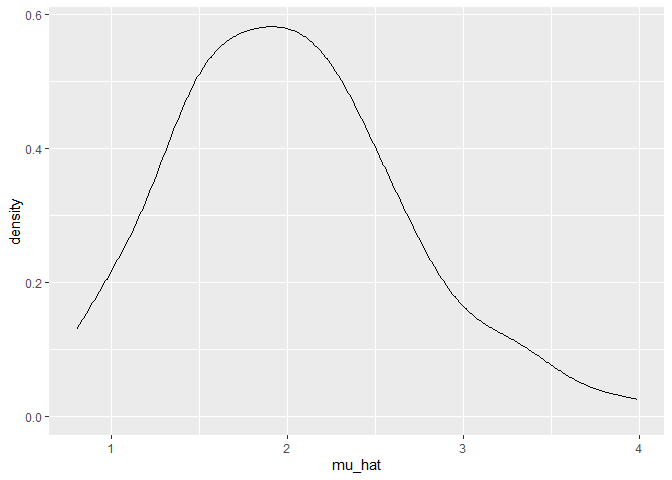
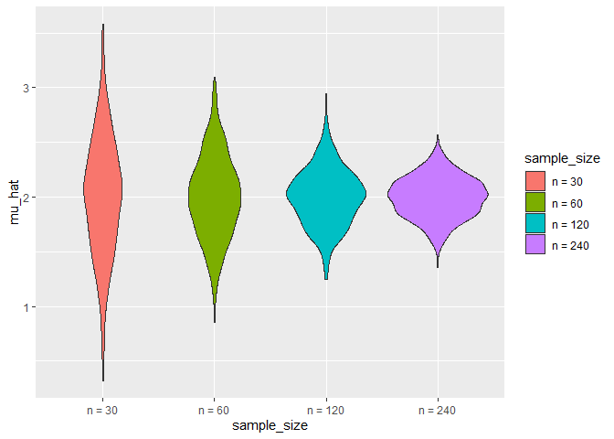

Untitled
================
Yiyao LI
2020/11/13

## Let’s simulate sth

function

``` r
sim_mean_sd = function(n, mu = 2, sigma = 3) {
  
  sim_data = tibble(
    x = rnorm(n, mean = mu, sd = sigma),
  )
  
  sim_data %>% 
    summarize(
      mu_hat = mean(x),
      sigma_hat = sd(x)
    )
}
```

simulate by this line

``` r
sim_mean_sd(30)
```

    ## # A tibble: 1 x 2
    ##   mu_hat sigma_hat
    ##    <dbl>     <dbl>
    ## 1   2.78      2.69

simulate a lot

``` r
output = vector("list", length = 100)

for (i in 1:100){
  output[[i]] = sim_mean_sd(30)
}

bind_rows(output)
```

    ## # A tibble: 100 x 2
    ##    mu_hat sigma_hat
    ##     <dbl>     <dbl>
    ##  1   2.27      3.11
    ##  2   1.39      2.55
    ##  3   2.33      2.63
    ##  4   3.17      2.10
    ##  5   1.50      3.23
    ##  6   1.16      3.21
    ##  7   2.07      3.76
    ##  8   2.20      2.64
    ##  9   2.39      2.67
    ## 10   2.62      3.22
    ## # ... with 90 more rows

loop function

``` r
sim_results = 
  rerun(100,sim_mean_sd(30)) %>% 
  bind_rows()
```

check

``` r
sim_results %>% 
  ggplot(aes(x = mu_hat))+geom_density()
```

<!-- -->

``` r
sim_results %>% 
  summarize(
    avg_mean = mean(mu_hat),
    avg_sd = mean(sigma_hat)
  )
```

    ## # A tibble: 1 x 2
    ##   avg_mean avg_sd
    ##      <dbl>  <dbl>
    ## 1     2.01   2.98

other samples

``` r
n_list = 
  list(
    "n_30"  = 30, 
    "n_60"  = 60, 
    "n_120" = 120, 
    "n_240" = 240)

output = vector("list", length = 4)

for (i in 1:4) {
  output[[i]] = rerun(100, sim_mean_sd(n_list[[i]])) %>% 
    bind_rows
}
```

``` r
sim_results = 
  tibble(sample_size = c(30, 60, 120, 240)) %>% 
  mutate(
    output_lists = map(.x = sample_size, ~rerun(1000, sim_mean_sd(n = .x))),
    estimate_dfs = map(output_lists, bind_rows)) %>% 
  select(-output_lists) %>% 
  unnest(estimate_dfs)
```

data frame thing

``` r
sim_results %>% 
  mutate(
    sample_size = str_c("n = ", sample_size),
    sample_size = fct_inorder(sample_size)) %>% 
  ggplot(aes(x = sample_size, y = mu_hat, fill = sample_size))+
  geom_violin()
```

<!-- -->

``` r
sim_results %>% 
  group_by(sample_size) %>% 
  summarize(
    avg_mean = mean(mu_hat),
    avg_sd = sd(sigma_hat)
  )
```

    ## `summarise()` ungrouping output (override with `.groups` argument)

    ## # A tibble: 4 x 3
    ##   sample_size avg_mean avg_sd
    ##         <dbl>    <dbl>  <dbl>
    ## 1          30     2.01  0.378
    ## 2          60     2.00  0.275
    ## 3         120     2.00  0.198
    ## 4         240     2.00  0.133
